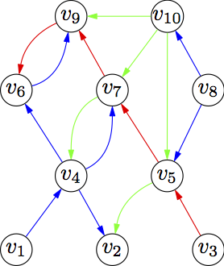

# LogDiv: A Python Module for Computing Diversity in Transaction Logs

LogDiv is a Python module for the computation of the diversity of items requested by users in transaction logs.

It takes two inputs:

1) A log file with transactions.
2) A file with item atributes.

Computing the diversity of items requested by users is a task of interest in many fields, such as sociology, recommender systems, e-commerce, and media studies. Check the example below.

## Getting Started

### Prerequisites

DivPy requires:

* Python
* Numpy - Essential
* Pandas - Essential
* Matplotlib - Essential
* tqdm - Optionnal: progression bar
* Graph-tool - Optionnal: only one function requires it


```shell
$ pip install numpy
$ pip install panda
$ pip install matplotlib 
$ pip install tqdm 
```

### Installing

To install LogDiv, you need to execute:

```shell
$ pip install logdiv
```

## Specification

### Entries format

LogDiv needs a specific format of entries to run:

- A file describing all requests under a table format, whose fields are:
* user ID
* timestamp
* requested page ID
* referrer page ID

- A file describing all pages visited under a table format, whose fields are:
* page ID
* topic 
* category

### YAML file

Code that use LogDiv are directed by a YAML file: if you want to modify entry files, or the features you want to compute, 
you just need to modify the YAML file, not the code itself.
This file is self-explanatory.

## Example

### Entries example
The following example illustrates the entries format of the package.



|user |timestamp          |requested_item|referrer_item|
|-----|-------------------|--------------|-------------|
|user1|2019-07-03 00:00:00|v1            |v4           |
|user1|2019-07-03 00:01:00|v4            |v2           |
|user1|2019-07-03 00:01:10|v4            |v6           |
|user1|2019-07-03 00:01:20|v4            |v6           |
|user1|2019-07-03 00:02:00|v6            |v9           |
|user1|2019-07-03 03:00:00|v8            |v10          |
|user1|2019-07-03 03:01:00|v8            |v5           |
|user2|2019-07-05 12:00:00|v3            |v5           |
|user2|2019-07-05 12:00:30|v5            |v7           |
|user2|2019-07-05 12:00:45|v7            |v9           |
|user2|2019-07-05 12:01:00|v9            |v6           |
|user3|2019-07-05 18:00:00|v10           |v5           |
|user3|2019-07-05 18:01:15|v10           |v7           |
|user3|2019-07-05 18:03:35|v10           |v9           |
|user3|2019-07-05 18:06:00|v7            |v4           |
|user3|2019-07-05 18:07:22|v5            |v2           |

| item_ID |   topic   | category  |
| ------- |:---------:|:----------|
|    v1   |  Football |  beginner |
|    v2   |  Tennis   |  pro      |
|    v3   |  Football |  beginner |
|    v4   |  Tennis   |  advanced |
|    v5   |  Rugby    |  medium   |
|    v6   |  Football |  beginner |
|    v7   |  Tennis   |  pro      |
|    v8   |  Football |  beginner |
|    v9   |  Tennis   |  advanced |
|    v10  |  Rugby    |  medium   |

In that example, the topic is a sport and the category is the level of the sport. 

### Test of LogDiv

To check if the module is successfully installed, and see what kind of results can be obtained, you can run the script in section example, using the entries given in the same directory.

